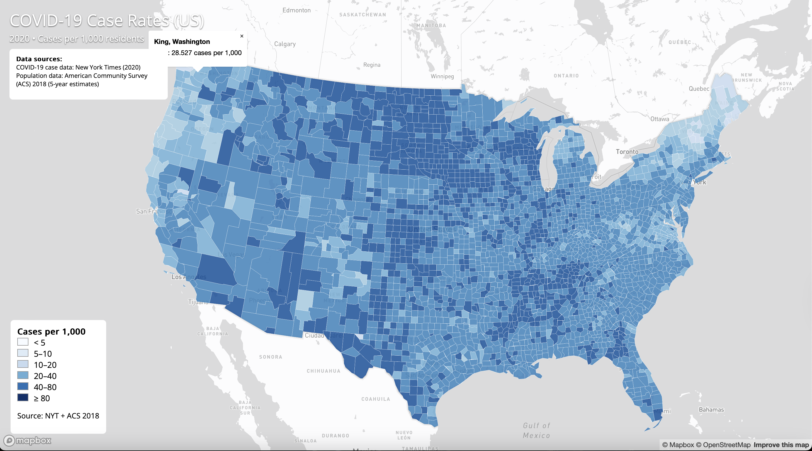
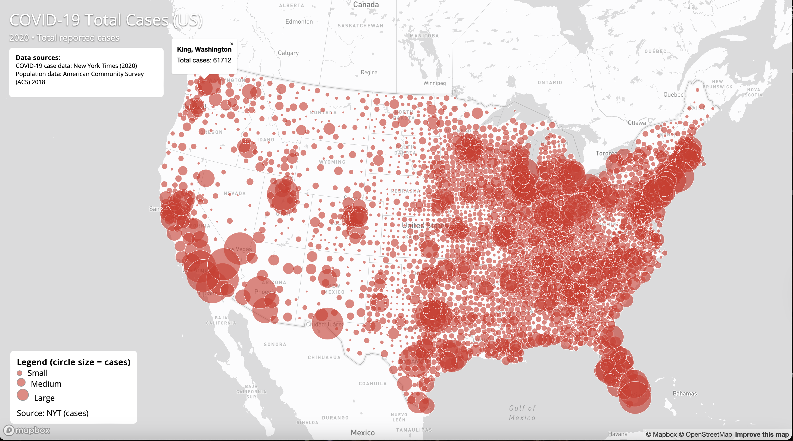

# COVID-19 Maps (US)

## Project Overview
This is a study about how COVID-19 was distributed geographically throughout the U.S. during 2020. The two maps were created so you could look at it from different perspectives. A choropleth map was used to compare (on a scale) the number of cases per thousand residents within each county. A proportional symbol map was used to compare which counties had the most total cases. Both maps allowed users to click on counties and see more detail about that county. I learned many new skills while creating these maps including: how to work with GeoJSON data, how to use Mapbox GL JS for web mapping, and how to create effective visualization techniques to convey complex spatial relationships effectively.

## Live Maps
Map 1 (Choropleth – Case Rates):  
https://meronwb.github.io/geog-458-covid-maps/map1.html  

Map 2 (Proportional Symbols – Total Cases):  
https://meronwb.github.io/geog-458-covid-maps/map2.html  

## Map Descriptions and screenshots
### Map 1: COVID-19 Case Rates

- **Map 1** shows COVID-19 case rates per 1,000 residents using a choropleth map.
  
### Map 2: COVID-19 Total Cases

- **Map 2** shows total COVID-19 cases using proportional circle symbols.
 
## Tools & Libraries
- Mapbox GL JS  
- JavaScript  
- HTML/CSS  

## Data Sources
- New York Times COVID-19 dataset (2020)  
- American Community Survey (ACS) 2018  

## Acknowledgment
This project was created for GEOG 458 at the University of Washington.
